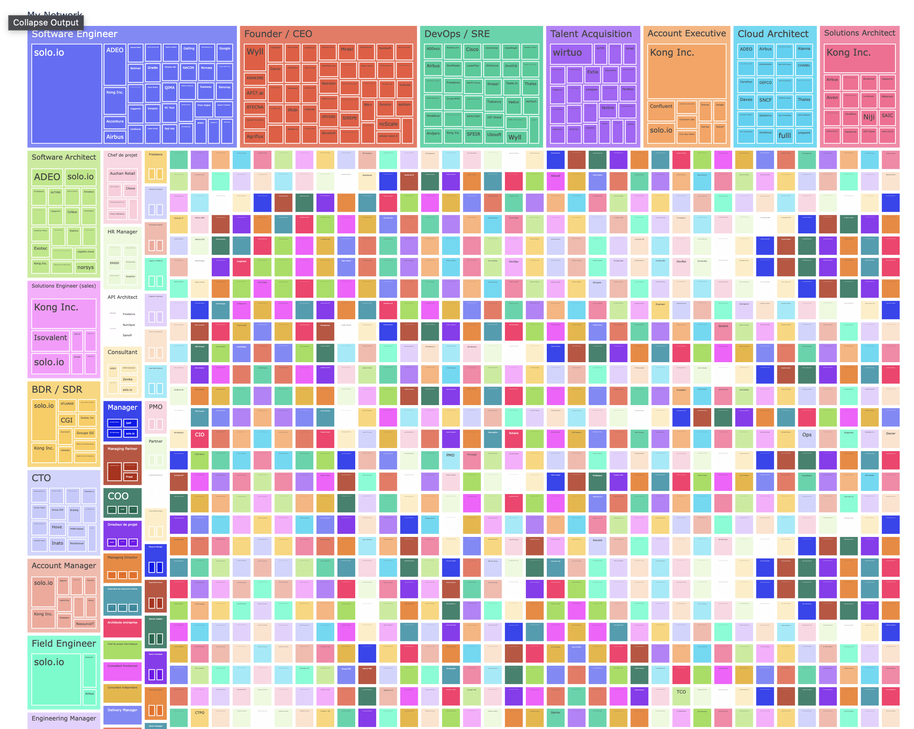

= LinkedIn Network Analysis =

Copied from https://towardsdatascience.com/visualizing-my-linkedin-network-c4b232ab2ad0

Preview:
// insert an image




== Data
Pull your personal data from LinkedIn, at https://www.linkedin.com/mypreferences/d/download-my-data


== Setup with Jupyter Labs ==
```shell
brew install jupyterlab

// pip install jupyter-dash
// pip install jupyterlab-plotly
// pip install plotly jupyterlab

jupyter lab build
// jupyter labextension install plotlywidget
// jupyter labextension install jupyter-matplotlib
// jupyter labextension install jupyterlab-dash
// jupyter labextension install jupyterlab-plotly


// open the lab UI
jupyter lab
```

